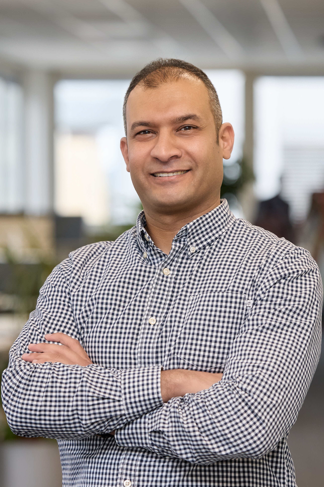

<table style="width: 100%; border-collapse: collapse; border: none;">
  <tr>
    <td style="border: none; vertical-align: top; text-align: left;">
      <h1 style="margin: 0;">Hassan Gamal Abdallh</h1>
      
<strong>Embedded Software Engineer</strong>

      

        📍 Stuttgart, Deutschland | 📞 +49 (1520) 798-3359 | 
        ✉️ <a href="mailto:hassangamalabdallh@email.com">hassangamalabdallh@email.com</a> | 
        🔗 <a href="https://www.linkedin.com/in/hassan-gamal-abdallh-99a33031/">LinkedIn</a> &nbsp;&nbsp;&nbsp;&nbsp;&nbsp;&nbsp;&nbsp;&nbsp;&nbsp;&nbsp;&nbsp;&nbsp;&nbsp;&nbsp;&nbsp;&nbsp;&nbsp;&nbsp;&nbsp;&nbsp;   
        🌍 Nationalität: Deutsch, Ägyptisch
      

    </td>
    <td style="border: none; text-align: right; vertical-align: top; width: 150px;">
      
    </td>
  </tr>
</table>

## Zusammenfassung
Ergebnisorientierter Embedded Software Engineer mit über 10 Jahren Erfahrung in Design, Entwicklung, Test und Integration eingebetteter Systeme in internationalen Projekten. Versiert in der Erstellung innovativer Prototypen, der Optimierung der Systemleistung sowie der Sicherstellung der Einhaltung von Industriestandards. Leidenschaftlich daran interessiert, zu zukunftsweisenden Technologien beizutragen, die intelligente, vernetzte und nachhaltige Lösungen vorantreiben.

## 💼 Berufserfahrung
**Systemingenieur** — Robert BOSCH GmbH — Stuttgart, Deutschland | Okt 2022 – heute
- **Schwerpunkt: Prototypenentwicklung für Advanced Driver Assistance Systems (ADAS)**
  - Mitarbeit an Systemdesign und Softwareentwicklung für ein neues ADAS-Feature; Erstellung eines Prototyps für Kundendemonstrationen
  - Übersetzung von Kundenanforderungen in umsetzbare technische Spezifikationen zur Unterstützung der Feature-Entwicklung
  - Zusammenarbeit mit dem Plattformteam zur Integration des Prototyps und Sicherstellung einer skalierbaren Umsetzung
- **Wichtigste Erfolge**
  - Bereitstellung eines voll funktionsfähigen ADAS-Prototyps für Kundendemos
  - Stärkung der funktionsübergreifenden Zusammenarbeit zwischen Entwicklung, Plattform und Validierung

**Embedded Softwareentwickler** — T&S GmbH (Leasing an Vector Informatik GmbH) — Stuttgart, Deutschland | Aug 2021 – Sep 2022
  - Konfiguration und Integration von AUTOSAR Basic Software (BSW)-Modulen mit DaVinci Configurator Pro, einschließlich COM-Stack, MEM-Stack, DIAG-Stack, OS und weiteren Modulen
  - Test und Validierung von AUTOSAR-Stacks auf Kundenhardware
  - Technischer Support für Kunden zur Lösung von Integrations- und Konfigurationsproblemen
  - Unterstützung der Teamproduktivität durch Wissensaustausch, Dokumentationspflege und Prozessverbesserungen
- **Wichtigste Erfolge**
  - Technischer Support für Kunden, Lösung von Konfigurationsproblemen und Verbesserung der Projektzeitpläne

**Embedded Software Developer** — T&S GmbH (Leasing an Robert BOSCH GmbH) — Stuttgart, Deutschland | Sep 2018 – Jul 2021
- **Projekt: Daimler – Automatisches Parken**
  - Verantwortlich für die finale Entwicklungsphase der Features „Kameraklappenschutz“ und „Parkschadenerkennung“ für Daimlers automatische Parksysteme zur Verbesserung der Fahrzeugsicherheit
  - Implementierung von KPI-Messskripten für dynamische Fusionsobjekte (Ultraschall + Kamera), um Erkennungsgenauigkeit und Robustheit auszuwerten
  - Durchführung von Laufzeitanalysen am Fahrzeug, Identifikation von Speicherengpässen und Optimierung der Software zur Verbesserung der Objekterkennung
  - Aufbau und Betreuung eines HIL-Teststands zur Simulation von Sensorfusion und Parkanwendungsfällen, Beschleunigung der Validierung und Reduzierung von Straßentests
  - Debugging und Validierung sowohl am HIL-System als auch am realen Fahrzeug unter unterschiedlichen Bedingungen
- **Wichtigste Erfolge**
  -  Erfolgreiche Serienfreigabe für die Features Kameraklappenschutz und Parkschadenerkennung
  -  Wesentlicher Beitrag zur Laufzeitoptimierung und Steigerung der Systemperformance

**Embedded Software Developer** — Valeo (Automatic Parking) — Smart Village, Ägypten | Jan 2016 – Jul 2018
- **Projekt: ADAS „Park4U“ – Ford F-150**
  - Integration von AUTOSAR-Applikationskomponenten mit BSW für Park4U-Projekte
  - Konfiguration und Validierung wichtiger AUTOSAR-Module (MCU, Port, DIO, GPT) zur Unterstützung der ECU-Funktionalität
  - Entwicklung und Test von MCAL-Treibern (CAN, MCU, Timer, OS) für verschiedene Hardwareplattformen
  - HIL-basierte Systemvalidierung zur Überprüfung der Hard- und Softwarekompatibilität
  - Unterstützung von Kundenbewertungen durch die Bereitstellung funktionaler Softwareprototypen
- **Wichtigste Erfolge**
  - Serienreife Integration von Park4U für Ford F-150
  - Unterstützung von frühen Kundendemos und Prototypvalidierungen

**Firmware Developer** — Karm Solar — Kairo, Ägypten | Okt 2014 – Nov 2015
- **Projekt: Solarbetriebene Farm-Automatisierung**
  - Entwicklung und Implementierung eingebetteter Firmware für solarbetriebene Bewässerungssysteme
  - Unterstützung bei der Implementierung und dem Test großflächiger landwirtschaftlicher Bewässerungslösungen
- **Wichtigste Erfolge**
  - Lieferung eines solargestützten Bewässerungssteuerungssystems zur Bewirtschaftung einer 4.000-Hektar-Farm

**Telekommunikationssoldat (Wehrdienst)** — Ägyptische Streitkräfte — Ägypten | Jan 2012 – Mär 2013

## 🎓 Ausbildung
**9-Monats-Diplom, Embedded System Engineering**, Information Technology Institute (ITI) — Kairo, Ägypten | Okt 2013 – Jun 2014

**B.Sc. Kommunikations- und Elektronikingenieurwesen**, Fakultät für Ingenieurwissenschaften, Universität Alexandria — Alexandria, Ägypten | Sep 2006 – Jun 2011

## 🛠️ Fähigkeiten
- Programmiersprachen: C, C++, Python
- Embedded- & Automotive-Tools:
  - Vector: DaVinci (Development & Configuration), CANoe (VN160, VN8610)
  - Debuggers: Lauterbach (PowerTrace), iSYSTEM, Renesas Debugging Tools
  - Compilers: Green Hills, Wind River
- Standards & Protokolle: AUTOSAR, CAN, LIN, Ethernet, SPI, UART
- Mikrocontroller & Plattformen: UltraScale ZU4, Renesas (RH850/F1x, RH850/P1x), PCC (Leo, Chorus), Aurix (TC3xx), Raspberry Pi
- Software- & Modellierungswerkzeuge: MATLAB/Simulink, CarMaker, Doxygen, Enterprise Architect
- Versionskontrolle & SCM: GIT/GitLab, TortoiseSVN
- Professional Training & Zertifizierungen:
  - Deep Learning Specialization — Coursera (In Progress)
  - [Complete Modern C++ (C++11/14/17) — Udemy](docs/UdemyCourse-CompleteModernC++_11_14_17.pdf)
  - [VECTOR AUTOSAR Automotive Ethernet](docs/VI-OET-Remote-Certificate-EN_AutomotiveEthernet.pdf)
  - [VECTOR AUTOSAR MICROSAR Ethernet Advanced](docs/VI-OET-Remote-Certificate-EN-MICROSAREthernetAdvancedCourse.pdf)
  - Embedded Custom Linux Systems with Yocto
- Other: Deutscher Führerschein — Klasse B

### 🌍 Sprachkenntnisse
-	Englisch: Fließend (IELTS 6 – B2, 2015)
-	Deutsch: Mittelstufe (B2)
-	Arabisch: Muttersprache

### 🎯 Hobbys & Interessen
- Lesen    
- Reisen und Schwimmen
- Fußball (SSV Zuffenhausen)
