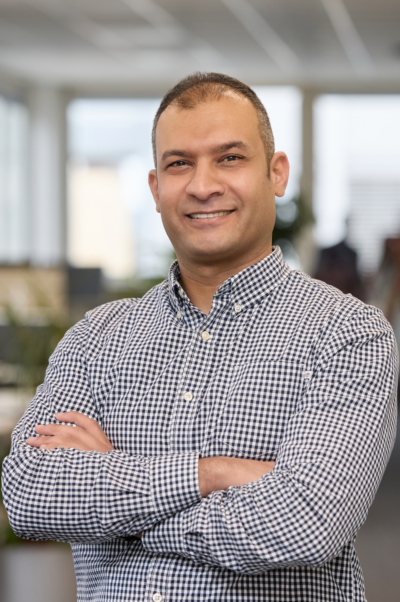

<table style="width: 100%; border-collapse: collapse; border: none;">
  <tr>
    <td style="border: none; vertical-align: top; text-align: left;">
      <h1 style="margin: 0;">Hassan Gamal Abdallh</h1>
      
<strong>Embedded Software Engineer</strong>

      

        📍 Stuttgart, Germany | 📞 +49 (1520) 798-3359 | 
        ✉️ <a href="mailto:hassangamalabdallh@email.com">hassangamalabdallh@email.com</a> | 
        🔗 <a href="https://www.linkedin.com/in/hassan-gamal-abdallh-99a33031/">LinkedIn</a> &nbsp;&nbsp;&nbsp;&nbsp;&nbsp;&nbsp;&nbsp;&nbsp;&nbsp;&nbsp;&nbsp;&nbsp;&nbsp;&nbsp;&nbsp;&nbsp;&nbsp;&nbsp;&nbsp;&nbsp;   
        🌍 Nationality: German, Egyptian
      

    </td>
    <td style="border: none; text-align: right; vertical-align: top; width: 150px;">
      
    </td>
  </tr>
</table>

## Summary
Results-oriented Embedded Software Engineer with over 10 years of experience in the design, development, testing, and integration of embedded systems across global projects. Skilled in creating innovative prototypes, enhancing system performance, and ensuring compliance with industry standards. Passionate about contributing to cutting-edge technologies that drive intelligent, connected, and sustainable solutions for the future

## 💼 Experience
**System Engineer** -- Robert BOSCH GmbH — Stuttgart, Germany | Oct 2022 – Present
- **Focus: Prototype Development for Advanced Driver Assistance Systems (ADAS)**
  - Worked on system design and software development for a new ADAS feature, preparing a prototype for customer demonstrations
  - Translated Toyota's customer requirements into actionable technical specifications to guide feature development
  - Collaborated with the platform team to integrate the prototype and ensure scalable implementation
- **Key Achievements**
  - Delivered a functional ADAS prototype ready for customer demos
  - Strengthened cross-functional collaboration between development, platform, and validation teams by introducing documentation standards

**Embedded Software Developer** -- T&S GmbH (Leased to Vector Informatik GmbH) — Stuttgart, Germany | Aug 2021 – Sep 2022
  - Configured and integrated AUTOSAR Basic Software (BSW) modules using DaVinci Configurator Pro, including COM stack, MEM stack, DIAG stack, OS, and others
  - Tested and validated AUTOSAR stacks on customer hardware
  - Provided technical support to customers, resolving integration and configuration issues
  - Supported team efficiency by sharing guidance, maintaining documentation, and improving processes
- **Key Achievements**
  - Provided technical support to customers, resolving configuration issues and improving project timelines

**Embedded Software Developer** -- T&S GmbH (Leased to Robert BOSCH GmbH) — Stuttgart, Germany | Sep 2018 – July 2021
- **Project: Daimler – Automatic Parking (Project: Daimler – Automatic Parking)**
  - Took ownership of the final development phase for the Camera Flap Protection and Park Damage Detection features for Daimler’s automatic parking systems, enhancing vehicle safety and system reliability
  - Implemented KPI measurement scripts for dynamic fusion objects (ultrasonic + camera sensors) to evaluate detection accuracy and robustness
  - Conducted runtime performance analysis on vehicles, identified memory bottlenecks, and optimized software for improved object detection in parking scenarios
  - Set up and maintained a HIL test bench simulating sensor fusion and parking use cases, speeding up validation and reducing dependence on on-road testing
  - Performed debugging and validation on both HIL systems and real vehicles to ensure feature stability under diverse environmental and operational conditions
- **Key Achievements**
  -  Successfully launched key safety features (Camera Flap Protection, Park Damage Detection) now integrated into production vehicles
  -  Contributed to significant runtime optimization, leading to a measurable increase in system responsiveness and memory efficiency

**Embedded Software Developer** -- Valeo (Automatic Parking) — Smart Village, Egypt | Jan 2016 – Jul 2018
- **Project: ADAS “Park4U” – Ford F-150**
  - Integrated AUTOSAR application components with BSW for the Park4U projects
  - Configured and validated key AUTOSAR modules (MCU, Port, DIO, GPT) to support ECU functionality
  - Developed and tested MCAL drivers (CAN, MCU, timers, OS) across multiple hardware platforms
  - Conducted HIL-based system validation to verify software and hardware compatibility
  - Supported customer evaluation projects by delivering functional software prototypes
- **Key Achievements**
  - Delivered production-ready Park4U integration for Ford F-150 vehicles
  - Supported early customer demos and prototype validation

**Firmware Developer** --Karm Solar — Cairo, Egypt | Oct 2014 – Nov 2015
- **Project: Solar-Powered Farm Automation**
  - Developed and implemented embedded firmware for solar-powered agricultural irrigation systems
  - Supported deployment and testing of irrigation solutions for large-scale farms
- **Key Achievements**
  - Delivered a solar-powered irrigation control system managing water supply for a 4,000-acre farm

**Telecommunication Soldier (Mandatory Military Service)** -- Egyptian Armed Forces — Egypt | Jan 2012 – Mar 2013

## 🎓 Education
**9-Month Diploma, Embedded System Engineering**, Information Technology Institute (ITI) — Cairo, Egypt | Oct 2013 – Jun 2014

**B.Sc., Communications and Electronics**, Faculty of Engineering, Alexandria University — Alexandria, Egypt | Sep 2006 – Jun 2011

## 🛠️ Skills
- Programming Languages: C, C++, Python
- Embedded & Automotive Tools:
  - Vector: DaVinci (Development & Configuration), CANoe (VN160, VN8610)
  - Debuggers: Lauterbach (PowerTrace), iSYSTEM, Renesas Debugging Tools
  - Compilers: Green Hills, Wind River
- Standards & Protocols: AUTOSAR, CAN, LIN, Ethernet, SPI, UART
- Microcontrollers & Platforms: UltraScale ZU4, Renesas (RH850/F1x, RH850/P1x), PCC (Leo, Chorus), Aurix (TC3xx), Raspberry Pi
- Software & Modeling Tools: MATLAB/Simulink, CarMaker, Doxygen, Enterprise Architect
- Version Control & SCM: GIT/GitLab, TortoiseSVN
- Professional Training & Certifications:
  - Deep Learning Specialization — Coursera (In Progress)
  - [Complete Modern C++ (C++11/14/17) — Udemy](docs/UdemyCourse-CompleteModernC++_11_14_17.pdf)
  - [VECTOR AUTOSAR Automotive Ethernet](docs/VI-OET-Remote-Certificate-EN_AutomotiveEthernet.pdf)
  - [VECTOR AUTOSAR MICROSAR Ethernet Advanced](docs/VI-OET-Remote-Certificate-EN-MICROSAREthernetAdvancedCourse.pdf)
  - [BOSCH_System Engineering Trainings](docs/BOSCH_certificates)
  - Embedded Custom Linux Systems with Yocto
- Other: German Driving License — Class B

### 🌍 Language Skills
-	English: Fluent (IELTS Score 6 <B2> in 2015)
-	German: Intermediate level (B2)
-	Arabic: Mother tongue

### 🎯 Hobbies & Interests
- Reading    
- Travel and Swimming 
- Football (SSV Zuffenhausen)
